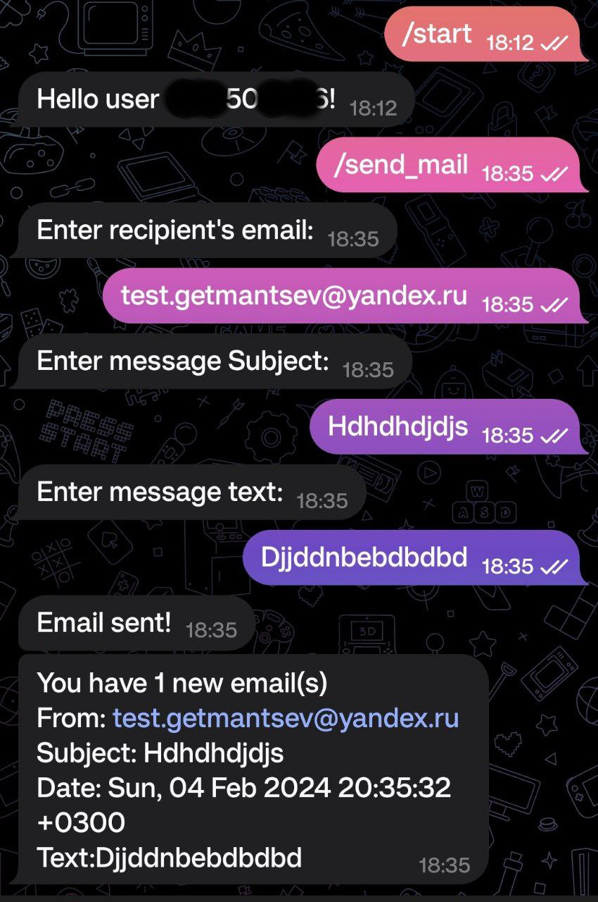
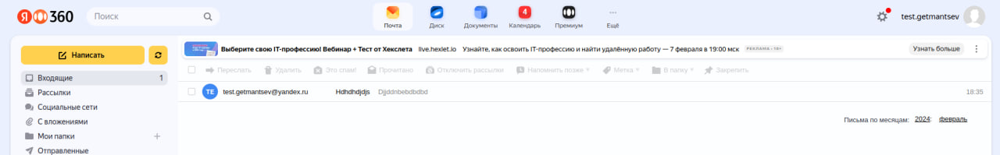

# Email Notifications Bot

Bot that send notifications about new messages from configured email.

See example.env to configure app.

To run bot

```bash
$ python3 -m venv venv
$ source venv/bin/activate
$ pip install -r requirements
$ python3 main.py
```

Example of work: \


